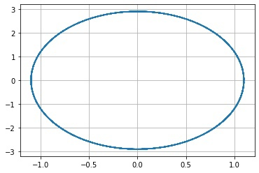
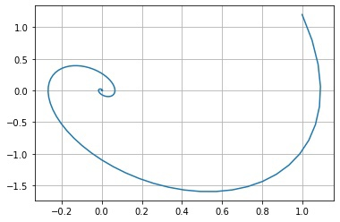
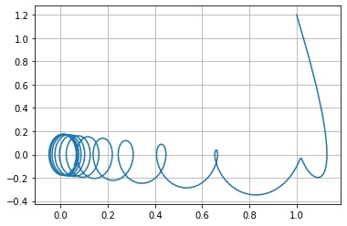

---
## Front matter
lang: ru-RU
title: "Отчет по лабораторной работе 4"
author: |
	Peytel Andrey Andreevich\inst{1}
institute: |
	\inst{1}RUDN University, Moscow, Russian Federation
date: 10 May, 2021 Moscow, Russian Federation

## Formatting
toc: false
slide_level: 2
theme: metropolis
header-includes: 
 - \metroset{progressbar=frametitle,sectionpage=progressbar,numbering=fraction}
 - '\makeatletter'
 - '\beamer@ignorenonframefalse'
 - '\makeatother'
aspectratio: 43
section-titles: true
---

# **Прагматика выполнения лабораторной работы**

# **Цель выполнения лабораторной работы**

## Цель

Построить модель гармонических колебаний с помощью Python.

# **Задачи выполнения лабораторной работы**

## Задание. Вариант 7

Постройте фазовый портрет гармонического осциллятора и решение уравнения гармонического осциллятора для следующих случаев:

1. Колебания гармонического осциллятора без затуханий и без действий внешней силы $\ddot {x} + 7x = 0$

2. Колебания гармонического осциллятора c затуханием и без действий внешней силы $\ddot {x} + 2 \dot {x} + 6x = 0$

3. Колебания гармонического осциллятора c затуханием и под действием внешней силы $\ddot {x} + 5 \dot {x} + x = cos(3t)$

На интервале $t \in [0; 25]$ (шаг 0,05) с начальными условиями $x_0 = 1, y_0 = 1,2$

# **Результаты выполнения лабораторной работы**

## График колебаний без затуханий и без действий внешней силы

{ #fig:001 width=70% } 

## График колебаний c затуханием и без действий внешней силы

{ #fig:002 width=70% }

## График колебаний c затуханием и под действием внешней силы

{ #fig:003 width=70% }

## Выводы

Построил модель гармонических колебаний с помощью Python.

## {.standout}

Спасибо за внимание!
